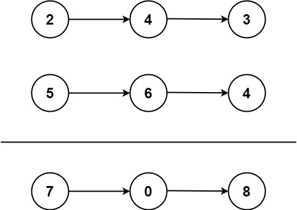

# Leetcode 2: 两数相加 - 2023/7/26
给你两个`非空`的链表，表示两个非负的整数。它们每位数字都是按照`逆序`的方式存储的，并且每个节点只能存储`一位`数字。
请你将两个数相加，并以相同形式返回一个表示和的链表。
你可以假设除了数字 0 之外，这两个数都不会以 0 开头。

```
示例 1：
输入：l1 = [2,4,3], l2 = [5,6,4]
输出：[7,0,8]
解释：342 + 465 = 807.
```



```
示例 2：
输入：l1 = [0], l2 = [0]
输出：[0]
```

# Analysis
引入变量t，计算单个节点l1 + l2，链表由后往前指，注意判断条件t > 0，仍要进入这个循环

# Code blcok
```
struct ListNode* addTwoNumbers(struct ListNode* l1, struct ListNode* l2){
    struct ListNode* list = malloc(sizeof(struct ListNode));
    int t = 0;
    struct ListNode* head = list;

    list->val = 0;
    list->next = NULL;
    while (l1 || l2 || t) {
        if (l1) {
            t += l1->val;
            l1 = l1->next;
        }
        if (l2) {
            t += l2->val;
            l2 = l2->next;
        }

        list->val = t % 10;
        t /= 10;

        if (l1 || l2 || t) {
            list->next = malloc(sizeof(struct ListNode));
            list->next->val = 0;
            list->next->next = NULL;
            list = list->next;
        }
    }
    return head;
}
```